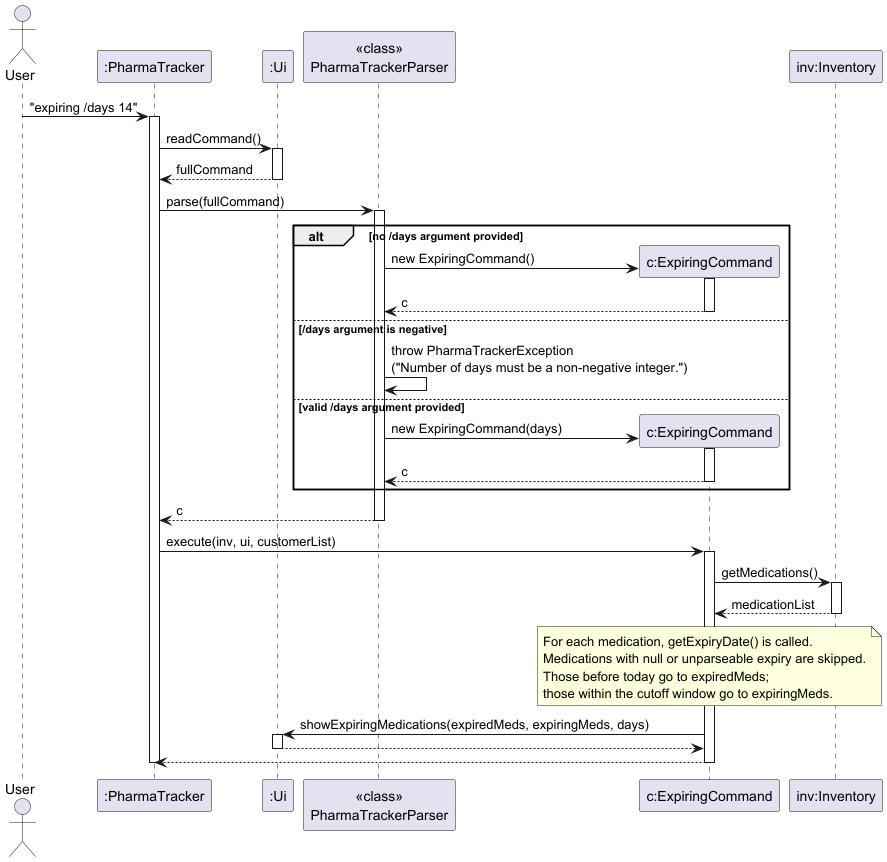
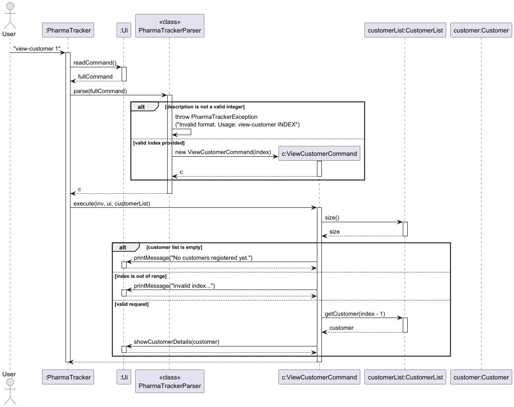

# Project Portfolio Page — Yi Herng (@yihernggggg)

## Overview

PharmaTracker is a command-line application for pharmacy staff to manage medication inventory
and customer records. It supports adding, finding, dispensing, and restocking medications, as
well as managing customer information and tracking dispensing history. Written in Java, it
targets users who prefer a fast, keyboard-driven workflow.

---

## Summary of Contributions

### Code Contributed

[View my code on the tP Code Dashboard](https://nus-cs2113-ay2526-s2.github.io/tp-dashboard/?search=&sort=groupTitle&sortWithin=title&timeframe=commit&mergegroup=&groupSelect=groupByRepos&breakdown=true&checkedFileTypes=docs~functional-code~test-code~other)

---

### Enhancements Implemented

#### 1. `view-customer` Command
Displays the full profile of a customer by 1-based index, including ID, name, phone, address,
allergies, and dispensing history. Uses two-stage validation in `execute()` (empty list, then
out-of-range) and throws `PharmaTrackerException` in the parser for non-integer input.

#### 2. `expiring` Command
Scans the inventory and reports expired medications and those expiring within a configurable
window (default 30 days). Key details:
- `expiring /days 0` is valid — medications expiring today appear in the "expiring soon"
  section because `!expiryDate.isAfter(today)` is true while `isBefore(today)` is false.
  No special handling needed; the date arithmetic handles it naturally.
- Medications with null or unparseable expiry dates are silently skipped without crashing
  the scan.
- Results are split into `expiredMeds` and `expiringMeds` for clearly labelled `Ui` output.

#### 3. `find` Command
Searches medications by name keyword (case-insensitive, partial match). An empty keyword
throws `PharmaTrackerException` before a `FindCommand` is created, preventing an empty
string from matching the entire inventory.

#### 4. `find-customer` Command
Searches customers by name keyword (case-insensitive, partial match). Delegates to
`CustomerList.findByName(keyword)` to keep search logic in the model layer. Empty keyword
throws `PharmaTrackerException` in the parser.

#### 5. `view` Command
Displays full medication details by 1-based index. Two-stage validation in `execute()`
(empty inventory, then out-of-range); parser throws `PharmaTrackerException` for missing
or non-integer index.

---

### Contributions to Testing

Wrote JUnit tests using the `ByteArrayOutputStream` output-capture pattern.

- **`FindCommandTest`** (8 tests) — exact, case-insensitive, and partial matches; multiple
  matches; no-match and empty inventory; null guard assertions.
- **`ExpiringCommandTest`** (16 tests) — expired and expiring-soon detection in `yyyy-MM-dd`
  format; custom window inclusion/exclusion; mixed inventory separation; malformed/null date
  graceful skip; default and explicit 30-day constructor parity.
- **`ViewCommandTest`** (12 tests) — all optional fields, `N/A`/`None` placeholders, invalid
  index variants, empty inventory, and parser exception for missing/non-integer index.
- **`ViewCustomerCommandTest`** (17 tests) — index boundary checks, no data leakage on
  invalid index, dispensing history shown after `DispenseCommand`, cross-customer history
  isolation.
- **`FindCustomerCommandTest`** (6 tests) — exact, case-insensitive, partial, and multiple
  matches; no-match and empty list.

---

### Contributions to the User Guide

Authored full entries for `view-customer`, `expiring`, `find`, `find-customer`, and `view`,
including format descriptions, parameter constraints, usage examples, and expected output
blocks matching the exact `Ui` formatting.

---

### Contributions to the Developer Guide

- Authored implementation sections (How it works, sequence diagram, Design Considerations)
  for: **View Customer**, **Expiring Medications**, **Find Medication**, **Find Customer**,
  and **View Medication** features.
- Designed the top-level **Architecture** section: component responsibility table,
  Architecture Component Diagram, and Architecture Sequence Diagram covering the full
  startup and command execution loop.
- Added manual testing instructions for all five owned features.

---

### Contributions to Team-Based Tasks

- Maintained `UserGuide.md` and `DeveloperGuide.md` for consistency across all sections.
- Set up `LoggerSetup` to redirect logging to `pharmatracker.log`, eliminating console noise
  during normal operation and test runs.
- Fixed `ExitCommand` calling `System.exit(0)` inside `execute()`, which silently killed the
  JVM mid-test; replaced with an `isExit()` flag pattern.
- Fixed storage corruption where dispensing history entries (containing `" | "` internally)
  collided with the `" | "` column delimiter in `saveCustomers()`; switched to `\t` (tab).
- Fixed silent customer data loss in `loadCustomers()` where `.trim()` stripped trailing tabs
  representing empty columns, causing rows with no address/history/allergies to be dropped;
  replaced with `.stripLeading()`.
- Fixed flag collision where `FLAG_DOSAGE = "/d"` matched inside `FLAG_DOSAGE_FORM = "/df"`;
  redefined as `"/d "` (with trailing space).
- Fixed warning-clear bug in `UpdateCommand` where `update INDEX /warn` left warnings
  unchanged; distinguished "flag absent" (`null`) from "flag present but empty" (empty list)
  in `UpdateCommandParser`.
- Fixed duplicate allergy storage where `/allergy peanuts,PEANUTS,peanuts` stored three
  entries; added `!allergies.contains(trimmed)` guard in `extractCustomerAllergies()`.

---

## Contributions to the Developer Guide (Extracts)

### Expiring Medications Feature (extract)

> **Steps 4–5** — The parser checks for the `/days` flag. If absent, `ExpiringCommand()` is
> constructed with the 30-day default. If present, the value is parsed as an integer; negative
> values throw `PharmaTrackerException`. Inside `execute()`, for each medication:
> - If the expiry date is `null` or unparseable, the medication is **skipped**.
> - If before today → added to `expiredMeds`.
> - If within the cutoff window → added to `expiringMeds`.



### View Customer Feature (extract)

> **Steps 3–5** — The parser throws `PharmaTrackerException` for a non-integer index. In
> `execute()`, `CustomerList.size()` is checked first (empty list guard), then the index
> bounds are validated. For a valid index, `Ui.showCustomerDetails(customer)` renders the
> full profile including allergies and dispensing history.



---

## Contributions to the User Guide (Extracts)

### `expiring` Command (extract)

> Format: `expiring [/days DAYS]`
> `DAYS` must be a non-negative integer. `expiring /days 0` is valid and lists medications
> expiring exactly today.
>
> ```
> ____________________________________________________________
> Already expired:
> 1. Name: Aspirin | Dosage: 100mg | Qty: 30 | Exp: 2025-01-01 | [EXPIRED] | Tag: painkiller
> Total: 1 medication(s) expired.
> ----------------------------------------
> Expiring within 14 days:
> 1. Name: Ibuprofen | Dosage: 200mg | Qty: 12 | Exp: 2026-04-10 | Tag: painkiller
> Total: 1 medication(s) expiring soon.
> ____________________________________________________________
> ```

### `view-customer` Command (extract)

> Format: `view-customer INDEX`
>
> ```
> ========================================
> CUSTOMER DETAILS
> ========================================
> Customer ID:         C001
> Name:                John Tan
> Phone:               99887766
> Address:             10 Orchard Road
> Allergies:           penicillin, aspirin
> ----------------------------------------
> DISPENSING HISTORY
> ----------------------------------------
> 1. Paracetamol | 500mg | Qty: 20
> ========================================
> ```
